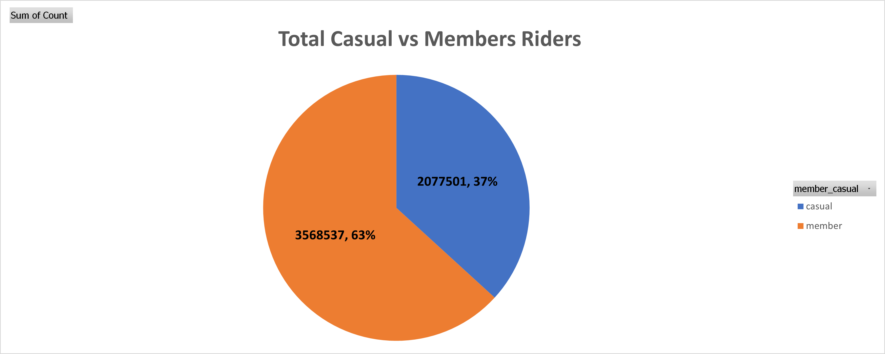

# Cyclistic-BikeShare-CaseStudy
## **Executive Summary**

Cyclistic, a Chicago-based bike-share program with 5,824 bikes and 692 stations, offers flexible pricing through single-ride, day passes, and annual memberships. While casual riders provide short-term revenue, finance analysts confirmed annual members are far more profitable. This case study analyzes 12 months of trip data to uncover differences in usage patterns and provide strategies to convert casual riders (37%) into annual members (63%), driving long-term growth.

## **Business Problem**

Cyclistic’s future success depends on maximizing annual memberships, which generate stable, recurring revenue

 The business question is:

 “How do annual members and casual riders use Cyclistic bikes differently, and how can we encourage casual riders to purchase annual memberships?”

## **Methodology**

1- Data Collection:
Combined 12 CSV files of ride data into one dataset.

2-Data Cleaning:
Removed null and duplicate values.
Standardized column formats (dates, ride types).
Created calculated fields (e.g., ride length in minutes, day of week).

3-Exploratory Analysis:
Aggregated data by day of week, rider type, and ride length.
Compared usage patterns between members and casuals.

## **Visualization**

1-Built charts to show ride frequency, duration, and preferences.

2-Used pivot tables (Excel) 

## **Skills Demonstrated**

1-Data Cleaning (Excel-Remove Duplicates, Find & Replace, TRIM)

2-Data Transformation (creating calculated fields, formatting)

3-Exploratory Data Analysis (grouping, aggregating, filtering)

4-Data Visualization (pivot tables, charts, dashboards)

5-Business Communication (turning insights into recommendations)

## 📊 **Results**

1-Casual riders prefer weekends and longer rides.

2-Members ride more consistently during weekdays, often for commuting.

3-Casual riders peak around 5 PM (afternoon/evening fun), members peak at 8 AM and 5 PM (commute times).

## **Business Recommendations**

1-Seasonal Subscriptions: Introduce summer membership packages (July–September), since casual ridership peaks during these months.

**Why this matters?**

The data showed casual ridership peaks during summer months, especially July–September. Casual riders in this period are often tourists, students on vacation, or locals doing outdoor activities.
Many of them ride multiple times in a short timeframe, but they don’t commit to annual memberships.
How this helps revenue?
Capturing demand : Instead of relying on one-time daily passes, Cyclistic can sell 3-month seasonal memberships.

**Example:**

A casual rider who might spend $8 per ride × 10 rides = $80.
A seasonal pass priced at $60–$70 could be cheaper for them, but ensures Cyclistic earns upfront guaranteed revenue.
Customer lock-in → Once someone pays for a seasonal pass, they’re more likely to use Cyclistic regularly → higher ride volume → more visibility of the service.
Conversion funnel → After summer, Cyclistic can target seasonal members with offers to convert into annual memberships (“Extend your membership and save 20%”).

Revenue Impact:
Suppose in July–Sept there are 200,000 casual riders.
If just 15% (30,000 riders) choose a $70 seasonal pass - $2.1M in revenue upfront.
Compare that to the same riders buying only a few single rides - revenue is scattered, unpredictable, and often lower.

**Why seasonal subscription and not Annual?**

Casual riders (especially tourists or summer-only users) often don’t see value in a full-year membership because they won’t use the service outside summer. Since the data shows a very low number of rides specially during winter compared to the peak no of rides durring summer time. So a 3-month seasonal plan feels like a smaller, safer commitment = easier to say yes.

2-Weekend Packages: Offer weekend-only passes or discounted Saturday/Sunday bundles to attract tourists and leisure riders.

3-Tourist-Friendly Offers: Partner with hotels, tourist hotspots, and travel apps to promote convenient bike access for short-term visitors.

4-Further Data Collection: Gather data to distinguish between local casual riders and out-of-state visitors. This will enable more tailored membership programs and targeted marketing campaigns.

**More data gathering like**

1-Gender - to explore if men and women ride differently (e.g., frequency, duration, preferred days).

2-Age group - to identify target demographics (young adults, middle-aged commuters, retirees).

3-Income level - to test whether affordability plays a role in choosing casual vs. annual memberships.

## **Next Steps**

1-Data Collection: Gather gender, age, income, and tourist vs. local data for a more accurate customer segmentation.

2-A/B Testing: Pilot seasonal/weekend offers to measure conversion impact.
